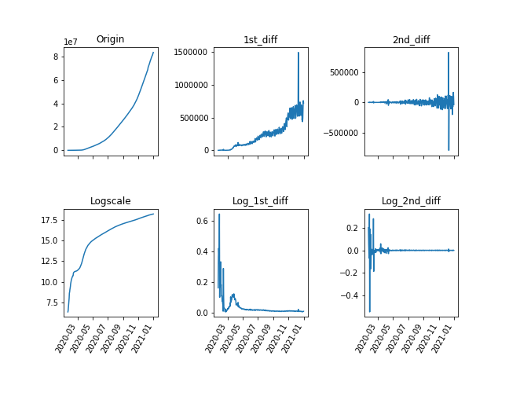
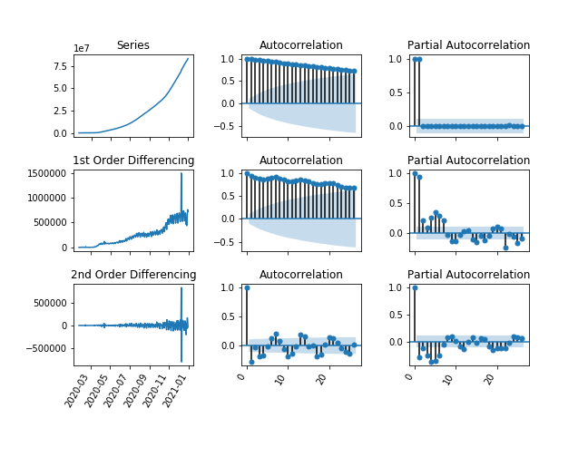
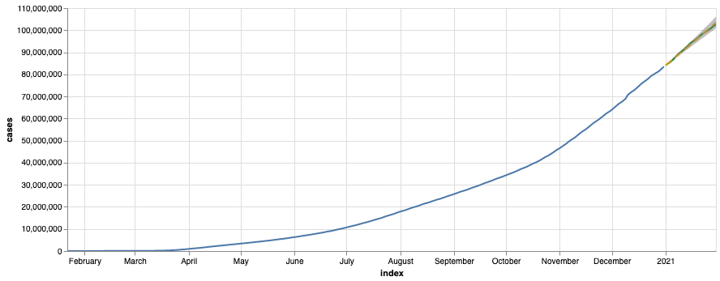
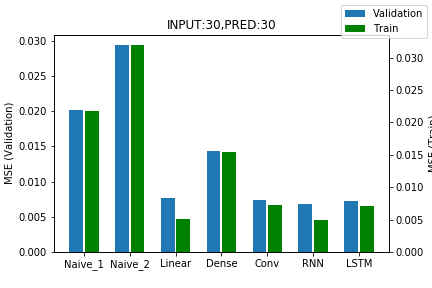
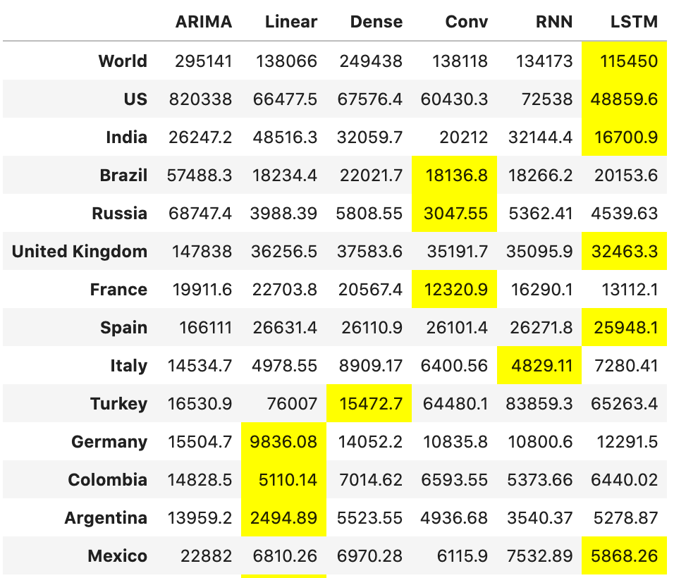

# COVID19 Case Prediction and Visualization

## Overview

Trained models  to predict covid-19 case using traditional ARIMA model and deep learning models including DNN, CNN, RNN, LSTM, cross-validate performance and showcase on web app built by streamlit.

## Dashboard

ARIMA and LSTM models are embedded into [Streamlit Dash Board](https://share.streamlit.io/scleeza/covid19visualization/app.py)

   >Streamlit only gave 800MB RAM for free user, so sometimes model calculation may encounter error due to lack of memory.

- **Local run**

    1. Clone repository to local doc
    
    2. Intall all the dependencies
        ```powershell
        pip install -r requirements.txt 
        ```
    3. Run streamlit app
        ```powershell
        streamlit run app.py
        ```
## Build ARIMA models

*ARIMA moodel training notebook.* [JupyterNoteBook](https://github.com/scleeza/COVID19Visualization/blob/master/arima.ipynb)

-  this notebook have
    1. Used differentiate method to get stationary data
    
        
        
    2. Stationarity test through Augmented Dickey-Muller statistics.
    3. Chose hyperparameter (p,d,q) through Auto Correlation Function and Partial Correlation Function.
    
        
        
    3. evaluate best ARIMA hyperparameters setting by **Grid Search**
    
        

## Build Neuron Network models

*NN models including DNN,CNN,RNN,LSTM*

Process of training models puts in [Jupyter Notebook](https://github.com/scleeza/COVID19Visualization/blob/master/rnn_final.ipynb)

- this notebook have
    1. How to generate time series tensor data, basically I use past 30 days data to predict cases in next 30 days.
    2. A train-in-once model, which generate all countries' next 30 days prediction .
    3. Built connectinng layer to deal with time series data when using DNN and CNN model.
    4. Hyperparameter tuning.
    5. Compared MSE of each models
    
        
    
## Pros and Cons between two methods  

This table show RMSE of each model's prediction in next 30 days, and NN models especially RNN/LSTM outperform others in large scale.



- ARIMA

    Pros
    1. Its more interpretable, since it is basically a kind of linear models. 
    2. Easy to set up
    3. Accurate when data is able find stationary state.
    
    Cos
    1. Not efficient when generating multiple outputs, e.g. each country requires its specific model.
    2. Can't use other features.
    
- NN
    basically is opposite to ARIMA model, except it provides more accurace result.
